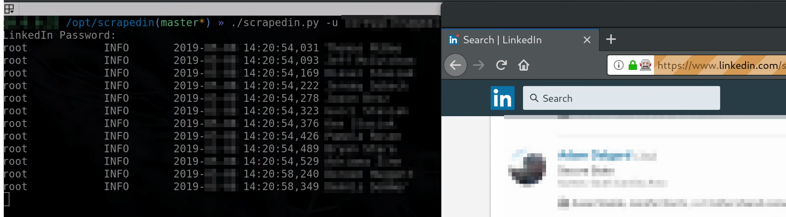

# ScrapedIn
Gere endereços de e-mail em potencial do LinkedIn

## Descrição
Em 2017 foi criado o scrapedin. A ferramenta foi mantida interna porque existe o temor de que o linkedin entre com uma ação legal por publicar um scrapper. Para superar esse medo, o scrapedin está sendo publicado sem nenhum crédito para os desenvolvedores. Ressalta-se que esta ferramenta deve ser utilizada por profissionais que realizam testes para organizações com as quais estão autorizados a trabalhar. O uso malicioso/ilegal desta ferramenta não é a intenção. Use por sua conta e risco, pois o scrapedin viola os TOS do linkedins. Se esta ferramenta for útil para você, agradeça espalhando a palavra.

O ScrapedIn permite reunir os nomes dos funcionários no LinkedIn e gerar e-mails no formato de sua escolha em tempo de execução (-s permite que os usuários especifiquem strings de formato). Isso é útil para testes de penetração que incluem phishing. Este scrapper depende do selênio e do gecko webdriver. Ao executar o scrapper, você poderá assistir ao scrapper acontecendo ao vivo em um navegador da web. A razão pela qual o scrapedin não foi feito sem cabeça é porque torna os problemas de depuração excepcionalmente fáceis.

Um arquivo CSV com o nome do usuário, e-mail, título, local e URL do perfil é gerado após a conclusão de uma raspagem. O Scrapedin também fornece aos usuários uma maneira de gerar endereços de e-mail de uma região geográfica específica, o que pode ajudá-lo a ser mais direcionado durante um envolvimento da equipe vermelha.




## Exemplo de uso:
```
# Scraping de emails por Nome de Empresa : 
./scrapedin.py -c "Taking" -o filename.csv -u molinalucas765@gmail.com -s {first:.1}{last}@{domain}.com

# Scraping de emails por Geo-região - busca emails de usuários de uma empresa dentro de uma região 
./scrapedin.py -c "Taking" -o filename.csv -u molinalucas765@gmail.com -s
{first}.{last}@{domain}.com -g "São Paulo Area"

# Scrape de emails por Indústria - busca emails de usuários de várias em empresas de mesmo nome, mas de indústrias diferentes
./scrapedin.py -c "Taking Inc." -o filename.csv -u molinalucas765@gmail.com -i Consuntoria

# Lista código e nome de Geo-regiões/Indústrias válidas para fazer o scrape
./scrapedin.py -l -g "São Paulo Area" -i "Consuntoria"
```

## Requirements:
* Selenium
* Firefox-ESR
* Gecko webdriver
* Python 3.3+


## Dependências de instalação:

#### Método Pipenv (recomendado)

Instale versões específicas do selenium & geckodriver via pipenv para uma experiência de raspagem mais segura e agradável. Este método permitirá que você execute scrapedin via `pipenv shell` ou `pipenv run python scrapedin.py` e respeitará suas bibliotecas externas instaladas globalmente.

**Basta instalar via**

```
git clone https://github.com/scrapedin/scrapedin
cd scrapedin
pipenv install
pipenv run python scrapedin.py 
```

OU se você preferir não usar um pipenv

```
pip install .
```

**Shortcut script**

Para maior conveniência, simplesmente adicione o seguinte script wrapper ao seu caminho `/usr/local/bin/` ou `$HOME/.local/bin/`.

```
cat <<EOF >> $HOME/.local/bin/scrapedin
#!/bin/bash
exec pipenv run python $(pwd)/scrapedin.py "\$@"

EOF
chmod +x $HOME/.local/bin/scrapedin
```

```
Scrapedin usará o caminho executável geckodriver local em webdriver/<arch>/geckodriver que é v0.24.0. A instalação manual não é mais necessária.
```

#### Instale manualmente o geckodriver (opcional)
Gecko Webdriver:

Encontre a versão atual do Gecko Webdriver aqui (https://github.com/mozilla/geckodriver/releases). Depois de ter o endereço da Web correto, siga estas instruções:

	wget https://github.com/mozilla/geckodriver/releases/download/v0.14.0/geckodriver-YOUR-VERSION.tar.gz
	tar -xvzf geckodriver-YOUR-VERSION.tar.gz
	sudo cp geckodriver /usr/bin/geckodriver
	rm gecko*

Firefox (Debian/Kali):


	sudo apt-get install firefox-esr
